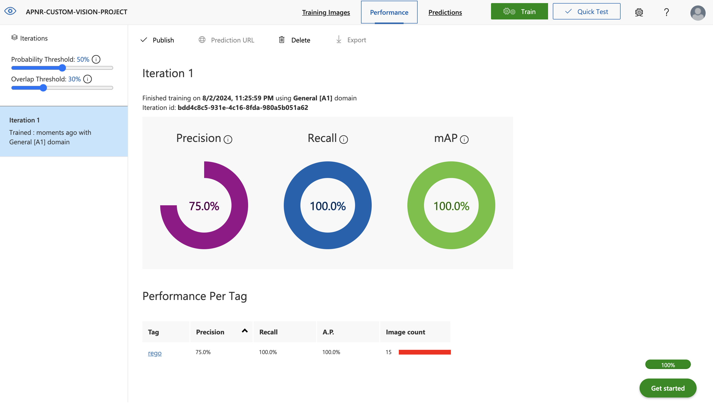
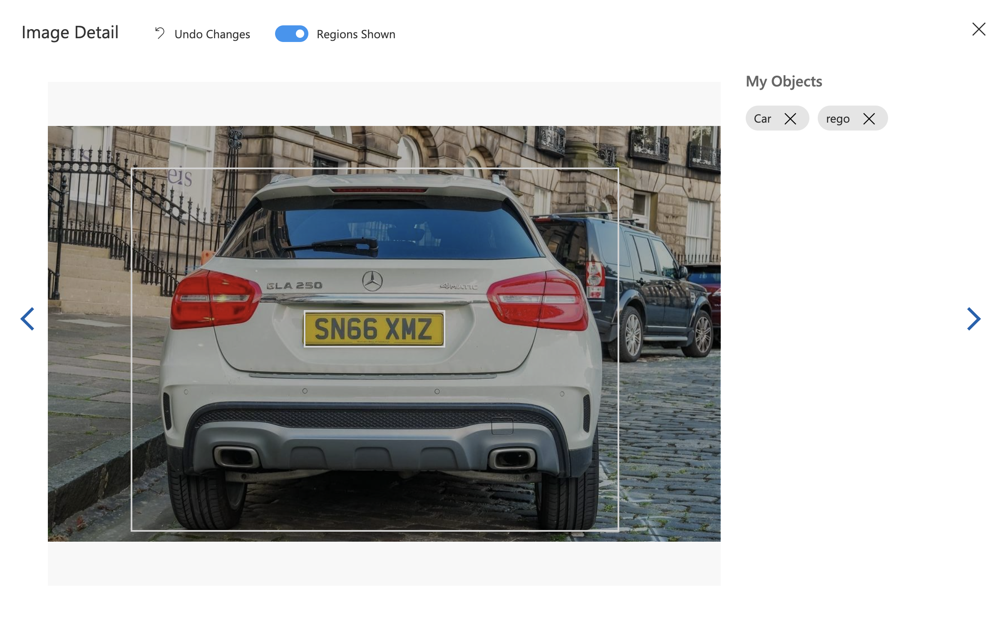
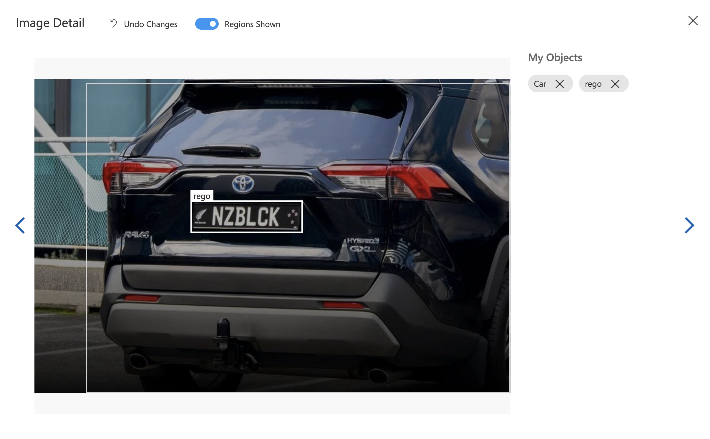
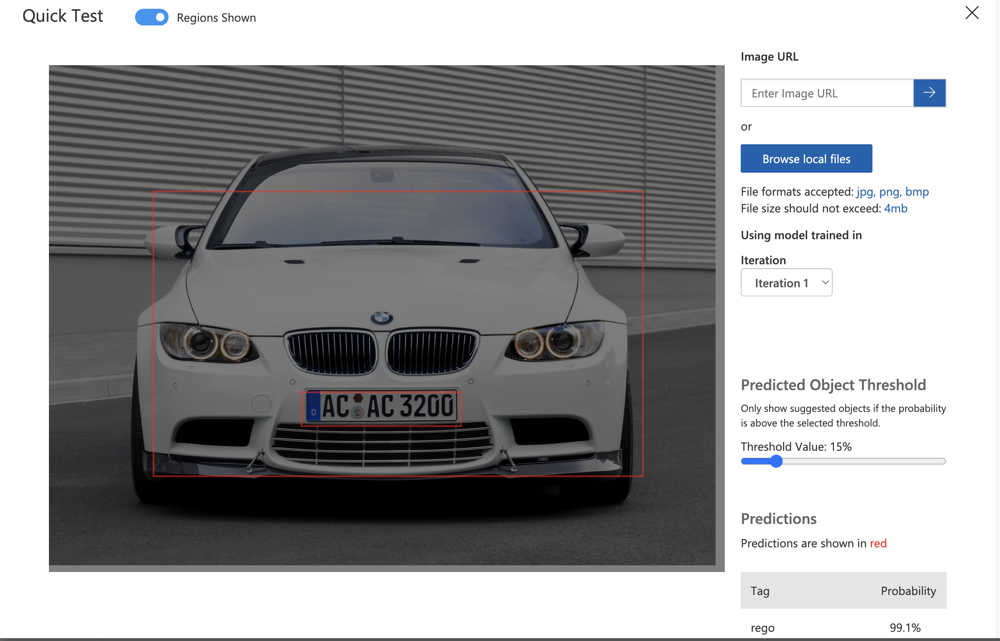
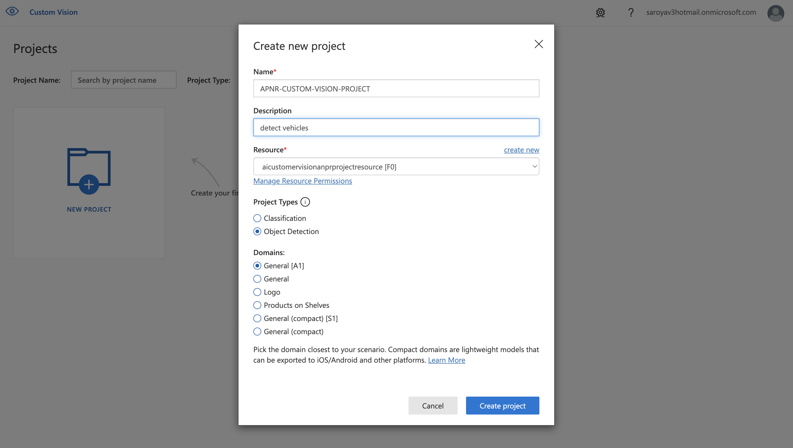

# Automated Number Plate Recognition (ANPR) Using Azure Custom Vision

- This project demonstrates how to use Azure Custom Vision and Azure Computer Vision OCR to detect and read number plates from images of cars. The project involves:
- Detecting the number plate in the image using a trained Custom Vision model.

### Training Evaluation.
  
### Annotation/Tagging Process.
  
  
### Testing the Model.
  
### Project Configuration.
  
